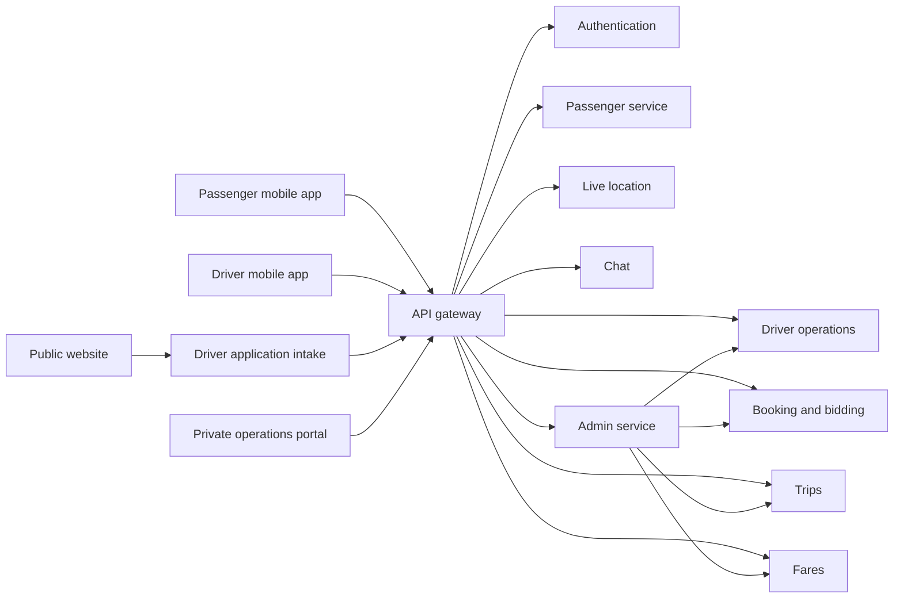

# EasyRide product plan and feature map

Last updated: 2026-08-01

This is the shared product-level source of truth for ongoing passenger, driver,
public-web, private-operations, and backend discussions. It records confirmed
decisions, current code surfaces, known gaps, and unresolved questions. It must
not contain passwords, tokens, personal test-account details, identity-document
contents, or payment credentials.

Volatile branch, runtime, build, and verification facts belong in
[`repo-current-state.md`](repo-current-state.md), not in this product plan.

Status labels:

- **Present**: a screen, route, or backend operation exists in the current branch.
- **Partial**: some code exists, but the complete user workflow is missing or unverified.
- **Planned**: agreed scope exists, but it has not been proven in the current branch.
- **Recommended**: current default proposal; the team has not confirmed it.
- **Open**: the team still needs to make a product or architecture decision.

“Present” does not mean production-ready. A feature becomes verified only after
its end-to-end acceptance test passes against a migrated disposable environment.

## System feature map



## Repository placement

Current:

```text
Apps/PassengerApp           Flutter passenger mobile app
Apps/DriverApp              Flutter driver mobile app
web/admin_app               SvelteKit operations frontend
server/admin-service        Bun/Hono admin backend (placement is correct)
```

Confirmed target layout:

```text
Apps/PassengerApp
Apps/DriverApp
web/public_site
web/admin_app
server/admin-service
```

Mobile applications remain under `Apps`. Both web frontends belong under
`web`, as requested by the teammate. The Admin backend remains under `server`.
The operations frontend move has been performed.

## Confirmed product decisions

| Area | Current decision |
|---|---|
| Public brand | Display **EasyRide** only; do not add “Admin,” “Owner Operations,” or another product suffix |
| Public website | `easyride.ph`; informational website with driver recruitment as the primary call to action |
| Booking channel | Mobile apps only for the MVP; no browser booking or browser fare calculator |
| Passenger website content | Explain cash rides, verified drivers, the Pagadian pilot, selected-barangay coverage, and upfront estimates shown in the app |
| Driver application | Dedicated first-party application form at `/drive/apply`, reviewed in the private operations portal |
| Public web hosting | Static public site on private-origin S3 with CloudFront |
| Private portal hosting | Separate server-rendered application at `admin.easyride.ph` |
| Operating city | Pagadian City only for the pilot |
| Vehicle | Bao Bao is the pilot vehicle |
| Pilot coverage | Specific barangays are not selected yet |
| Zone defaults | All barangays begin inactive |
| Passenger payment | Cash is the expected initial ride-payment method |
| Driver commission funding | Driver prepaid balance |
| Initial commission | 10%, subject to final team approval before real rides |
| Commission reservation | Reserve the exact commission atomically when assignment succeeds |
| Credit balance | Cannot become negative |
| Top-up limits | ₱100 minimum; ₱1,000 maximum purchased-credit balance |
| Top-up verification | Driver submits reference; authorized employee verifies the external payment |
| Sensitive payment data | Never store wallet passwords, PINs, or secret payment credentials |
| Operations accounts | One privately provisioned owner; no public registration or password-reset link |
| Driver duplicate prevention | Normalized driver’s-license identity is unique across active and inactive applications/accounts |
| Driver application documents | License, franchise ID/number, mobile number, OR/CR, plate number, and a vehicle photo showing the plate |
| Document storage | MinIO locally; dedicated private encrypted S3 bucket in production; never the public website bucket |
| Document access | Short-lived signed upload/view URLs; masked identifiers in routine screens |
| Rejected application retention | 90 days by default, pending legal/privacy review |
| Boundary data | Interim geometry is development-only until approved for public enforcement |
| Money storage | Integer centavos; rates in basis points |
| Time storage/display | UTC in APIs; Asia/Manila display |

### Decisions confirmed during workflow review

- **Matching workflow**: drivers do not propose prices because the platform uses
  a fixed fare. The passenger sees a live list of the five nearest eligible
  drivers, ordered only by pickup distance or road ETA; rating does not affect
  the order. The passenger selects one driver, that driver remains visible until
  an acceptance succeeds, and the first request the driver successfully accepts
  wins. The MVP target is a five-second list refresh plus immediate refresh when
  the screen opens, a driver accepts, a driver goes offline, or capacity becomes
  unavailable. Atomic assignment is mandatory. Candidate cards show driver
  photo, first name and surname initial, pickup ETA/distance, rating, rating
  count, completed EasyRide trips, and vehicle summary. Missing ratings must not
  silently display as 5.0. The request timeout remains open.
- **Driver request inbox**: display oldest requests first. Before acceptance,
  show Shared/Premium type, fixed fare, passenger first name and surname
  initial, pickup ETA/distance, approximate route, passenger-trip distance,
  declared seats, payment method, and request age. Exact locations, full
  identification, and communication details appear after acceptance.
- **Pilot products**: Shared and Premium only. The current Solo Ride option is
  not part of the intended pilot.
- **Shared**: unrelated passengers may join after the trip begins and may have
  different pickups and destinations. Vehicle capacity is five passengers.
  A cancellation before pickup removes only that passenger's pickup/drop-off,
  reroutes the remaining trip, leaves other quoted fares unchanged, and releases
  only the canceled booking's commission reservation. A voluntary early
  drop-off retains the passenger's full quoted fare. Destinations become
  immutable after confirmation. Seats per individual Shared booking,
  detour/wait limits and stop sequencing remain open. Shared uses a fixed 1.0
  product multiplier in the MVP. There is no occupancy-dependent or retroactive
  discount; a later version may add a fixed rule after pilot evidence.
- **Premium**: one booking owner, immutable predeclared destinations, and no
  in-app fare split remain the current direction. Party size and pricing are
  reopened because a vehicle-wide fare for five people sharing one destination
  may create unwanted price arbitrage. The team must choose among a
  single-passenger product, a group product with a per-additional-passenger
  component, or a vehicle-wide group fare. The Premium multiplier/minimum and
  stop-order rule also remain open.
- **Driver-caused interruption**: charge the passenger nothing, release the
  commission reservation, and create an interrupted-trip admin case. Any
  legitimate driver compensation is reviewed separately and is not collected
  from the stranded passenger.
- **Fare direction**: use a first-kilometer amount plus a succeeding-kilometer
  rate. No time-based fare is intended. Exact rates, minimum fare, rounding,
  distance source, and surge policy still require confirmation.
- **Driver applications**: applicants may correct submissions; approval should
  create the account; activation instructions go to the registered contact
  number; rejected applicants may reapply. Plaintext passwords must not be sent.
- **Document expiry**: expiry blocks driving. Renewed documents may enter review
  before the old document expires. Notification frequency and data-retention
  details remain open.
- **Pilot coverage**: the current candidate scope is 18 barangays, but the names
  and initial activation subset are not selected.
- **Portal records**: Passenger, Vehicle, and searchable Trip records are
  confirmed for the MVP private portal.

## Public website feature map

### 1. Homepage

- **Planned**: EasyRide identity without an “Admin” or other product suffix.
- **Planned**: driver-recruitment-first hero with **Drive with EasyRide** and
  **Apply now** as the main action.
- **Planned**: passenger explanation covering cash payment, verified drivers,
  Pagadian pilot coverage, and upfront estimates in the mobile app.
- **Planned**: links to support, privacy information, and the mobile apps when
  supported release links exist.
- **Deliberately excluded from MVP**: browser booking, browser fare calculation,
  passenger waitlist, and non-working app-store buttons.
- **Deliberately excluded from public copy**: exact commission and prepaid-credit
  rules; explain these to applicants after initial screening.

### 2. Driver application

- **Planned**: dedicated `/drive/apply` form, not Google Forms.
- **Planned**: collect legal name, mobile number, driver’s-license
  number/photo, franchise ID or number/photo, OR/CR photo, plate number, and a
  vehicle photo clearly showing the plate.
- **Planned**: the applicant confirms privacy/accuracy declarations before
  submission.
- **Planned**: issue a reference number and provide a manual contact channel
  after submission.
- **Planned**: send applications to the private review queue; submission does
  not immediately create an approved driver account.
- **Planned**: reject duplicate normalized license numbers and flag matching
  plate/franchise identifiers for manual review.

### 3. Sensitive-document handling

- **Planned**: browser uploads directly to private object storage through
  short-lived signed URLs; the API stores metadata and object keys only.
- **Planned**: validate allowed type, size, ownership, and application state
  before accepting an upload.
- **Planned**: reviewers use expiring signed view links. Files are never public
  and are never served from the public website bucket.
- **Launch gate**: approved privacy notice, data-controller/contact ownership,
  retention/deletion procedure, and access-control review.

## Passenger feature wireframe

### 1. Entry and account

- **Present**: onboarding.
- **Present**: email/password sign in.
- **Present**: passenger signup.
- **Present**: six-digit email OTP verification screen.
- **Present**: forgot-password, OTP, and password-reset screens.
- **Partial**: Google sign in and signup; visual button only.
- **Planned**: clear restricted-account messaging.

### 2. Home and places

- **Present**: passenger home with map and current location.
- **Present**: recent activity and suggestions surfaces.
- **Present**: saved places and add-category screens.
- **Present**: destination search.
- **Present**: nearby POI search up to 5 km with incremental loading.
- **Present**: Mapbox geocoding and map pin selection.
- **Present**: pickup and destination route preview.
- **Partial**: location-denied, Mapbox-unavailable, and empty-result behavior
  exist in parts but need device testing.

### 3. Fare and service selection

- **Present**: distance and duration route calculation.
- **Present**: server fare request with a local estimate fallback.
- **Present**: Solo Ride selection.
- **Present**: Share-Bao selection.
- **Present**: Bao Premium selection.
- **Present**: fare, ETA label, and route preview.
- **Open**: whether all three products belong in the pilot.
- **Open**: seat count and shared-ride pricing/route rules.
- **Open**: whether surge exists in the pilot.
- **Open**: the final base, distance, time, minimum, and rounding formula.
- **Planned**: expose Shared and Premium only; remove Solo from the pilot
  selection after the shared-product rules are settled.

### 4. Booking and matching

- **Present**: create a booking/bidding session.
- **Present**: fetch nearby/eligible drivers.
- **Present**: receive driver offers.
- **Present**: passenger accepts an offer.
- **Present**: direct-booking path to a selected nearby driver.
- **Present**: cancellation of a search/session.
- **Planned**: exclude any driver who cannot reserve the exact commission.
- **Planned**: validate both pickup and destination against active zones.
- **Planned**: live fixed-fare shortlist of the five nearest eligible drivers,
  ordered only by pickup distance or road ETA and refreshed every five seconds.
- **Planned**: passenger chooses one candidate; the first request that driver
  successfully accepts wins, with an atomic availability check.
- **Planned**: candidate and driver-request cards use the confirmed fields above;
  the driver inbox displays oldest first.
- **Planned**: refresh immediately on screen entry and material availability
  changes in addition to the five-second poll.
- **Open**: distance tie-breaker, accept/expiry timing, and how an accepted
  Shared trip remains discoverable for compatible additional passengers.
- **Open**: passenger and driver cancellation/no-show rules.

### 5. Active trip

- **Present**: finding-driver screen.
- **Present**: driver-matched screen.
- **Present**: live driver location lookup and tracking screen.
- **Present**: passenger-driver chat screen and backend chat room/WebSocket.
- **Present**: trip detail map.
- **Partial**: help and safety surfaces; some actions say “coming soon.”
- **Planned**: precise out-of-zone, restricted-account, and prepaid-balance
  failure messages.

### 6. After the trip and account support

- **Present**: recent activity, full activity, ride history, and ride details.
- **Present**: driver rating screen.
- **Present**: passenger profile and profile-information screens.
- **Present**: inbox/notification surface and backend notification route.
- **Present**: settings and help center.
- **Partial**: several help-center actions and Safety Center are placeholders.
- **Open**: complaint submission entry point and required categories.

## Driver feature wireframe

### 1. Entry and driver identity

- **Present**: email/password sign in.
- **Present**: forgot-password request.
- **Partial**: Google sign in; visual button only.
- **Missing in client**: driver signup.
- **Missing in client**: driver OTP verification.
- **Present in backend**: driver registration and OTP generation.
- **Planned**: unique driver-license enforcement.
- **Planned**: operational approval separate from email verification.
- **Planned**: required document results: pending, verified, rejected, expired.
- **Planned**: temporary or indefinite restrictions.

### 2. Operating status and dashboard

- **Present**: dashboard.
- **Present**: online/offline control.
- **Present**: location telemetry while online.
- **Present**: dashboard statistics.
- **Present**: active-trip and incoming-request polling.
- **Present in backend**: eligibility checks for approval, documents,
  restrictions, zone, and available driver prepaid balance.
- **Planned**: precise blocking reason in the driver UI.
- **Open**: the code currently permits up to five concurrent rides and applies
  special Bao Premium rules. The product team must decide whether this is valid
  for a Bao Bao pilot.

### 3. Offer and assignment

- **Present**: view active booking sessions.
- **Present**: submit a proposed-fare offer.
- **Present**: cancel an offer.
- **Present**: receive/continue an accepted trip.
- **Present in backend**: normal and manual assignment share eligibility and
  credit-reservation logic.
- **Planned**: driver is excluded or blocked when available credit is below
  the snapshotted commission.
- **Planned**: drivers accept or decline a platform-calculated fare; they do not
  propose a fare during the pilot.

### 4. Trip lifecycle

- **Present**: ride alert.
- **Present**: en route to pickup.
- **Present**: arrived/waiting for passenger.
- **Present**: in transit.
- **Present**: complete trip.
- **Present**: fare summary.
- **Present**: rate passenger.
- **Present**: resume active trip after returning to the dashboard.
- **Present**: external map/navigation integration surface.
- **Partial**: some duration/distance values in the dashboard completion path
  are currently fixed fallback values and need real-trip validation.
- **Open**: wait time, no-show, cancellation, and unpaid-cash handling.

### 5. Earnings, credits, and account

- **Present**: trip history and trip details.
- **Present**: earnings screen and dashboard earnings statistics.
- **Present**: account screen.
- **Present**: driver prepaid balance.
- **Present**: immutable credit-ledger view.
- **Present**: top-up channel list.
- **Present**: top-up submission and history.
- **Present in backend**: minimum/cap, duplicate reference, adjustments,
  refunds, reservation, settlement, release, and dispute.
- **Planned**: low-balance warnings and fully tested blocking messages.

## Private operations portal feature map

### 1. Access

- **Present**: privately provisioned owner.
- **Present**: email/password login.
- **Present**: eight-hour admin JWT.
- **Present**: secure HttpOnly session cookie in the current SvelteKit design.
- **Present**: logout.
- **Present**: failed-login lock.
- **Planned**: host the server-rendered portal separately at
  `admin.easyride.ph`; the public S3/CloudFront site does not replace this
  authentication arrangement.
- **Planned UI rule**: the access page displays **EasyRide** and **Sign in**
  only. Do not show “EasyRide Admin,” “Owner Operations,” role labels, a public
  registration link, or a password-reset link.

### 2. Overview

- **Present**: totals for trips, drivers, pending top-ups, cases, and zones.
- **Present**: operational queues and recent activity.
- **Present**: 10-second refresh on operational pages.
- **Recommended**: final primary navigation is Overview; Driver applications;
  Drivers and documents; Passengers; Vehicles; Trips; Live dispatch; Credits
  and pricing; Zones; Cases and restrictions; Reports and audit.

### 3. Driver compliance

- **Present**: list and filter drivers.
- **Present**: pending/approved/rejected operational approval.
- **Present**: owner-managed document requirement names.
- **Present**: document review status, expiry, note, reviewer, and time.
- **Present**: driver restrictions and lifting.
- **Planned**: review privately stored application documents using short-lived
  signed links; do not copy the files into the admin-service database.
- **Planned**: compare normalized license, franchise, OR/CR, plate, and vehicle
  details before approving or linking an application to a driver account.

### 4. Passengers, vehicles, and trips

- **Planned**: searchable passenger list with account and restriction
  status, ride history, and support context.
- **Planned**: searchable vehicle registry linked to driver, plate,
  franchise, OR/CR, verification state, and document expiry.
- **Planned**: searchable trip list with lifecycle state, passenger,
  driver, fare snapshot, commission, assignment source, and audit history.

### 5. Dispatch

- **Present**: open requests and active trips.
- **Present**: Mapbox dispatch view.
- **Present**: manual assignment.
- **Present in backend**: manual assignment cannot bypass driver eligibility,
  fare snapshot, or commission reservation.
- **Open**: final assignment/matching policy.

### 6. Credits, top-ups, fares, and commission

- **Present**: top-up channels.
- **Present**: top-up review and rejection.
- **Present**: credit balance and ledger.
- **Present**: owner adjustments and verified refunds.
- **Present**: fare-rule management.
- **Present**: commission policy and future scheduling.
- **Planned**: operational runbook and real reconciliation exercise.

### 7. Zones

- **Present**: 54-name Pagadian barangay roster.
- **Present**: interim development polygons.
- **Present**: activate/deactivate zone.
- **Present in backend**: pickup and destination zone check.
- **Open**: pilot barangays.
- **Open**: approved boundary authority/source for public enforcement.

### 8. Complaints, restrictions, reports, and audit

- **Present**: cases targeting a trip, passenger, or driver.
- **Present**: open, under-review, resolved, and dismissed states.
- **Present**: optional linked restriction.
- **Present**: append-only audit view.
- **Present**: filtered CSV reports.
- **Present**: printable browser report routes.
- **Open**: complaint categories, escalation policy, support wording, and
  response targets.

## Backend and shared platform capabilities

| Capability | Current surface |
|---|---|
| Gateway | Routes public requests, strips client internal-auth headers |
| Authentication | Passenger, driver, and admin login; passenger/driver registration; OTP/reset |
| Passenger data | Profile, updates, ride history, restrictions, notifications |
| Driver data | Profile, online status, statistics, trips, reviews |
| Driver operations | Approval, documents, restrictions, credits, top-ups, eligibility |
| Booking/bidding | Sessions, offers, passenger acceptance, cancellation, manual assignment |
| Trip lifecycle | Create, assign, accept, status changes, history, reconciliation |
| Telemetry | Driver location update and lookup |
| Chat | Chat rooms, messages, resolution, WebSocket |
| Fare | Configurations, estimates, final fare, snapshots, commission |
| Admin | Overview, compliance, dispatch, money, zones, cases, reports, audit |
| Database | PostgreSQL with additive migrations and service-specific databases |
| Local orchestration | Docker Compose; only gateway/database and current admin web are host-exposed |

## Cross-team dependency matrix

| Product decision or contract | Passenger impact | Driver impact | Admin/backend impact | Status |
|---|---|---|---|---|
| Ride products and seat rules | Shared and Premium options | Capacity and concurrent rides | Pricing and dispatch rules | **Partial decision** |
| Fare formula and rounding | Quote shown before booking | Earnings/fare summary | Fare rules and snapshots | **Open** |
| Matching model | Live five-nearest shortlist; passenger chooses | First successful acceptance wins | Distance/ETA order, five-second refresh, atomic assignment | **Planned** |
| 10% prepaid commission | Booking eligibility messaging | Balance and block reason | Reservation/ledger/settlement | **Planned** |
| Cancellation/no-show | Cancellation UI and charge | Release/compensation | Trip and credit transitions | **Open** |
| Cash not received | Support status | Dispute submission | Hold/review/reconciliation | **Open** |
| Active barangays | Out-of-zone message | Online/offer eligibility | Zone configuration | **Open** |
| Driver documents | Driver identity shown | Submission/status guidance | Public intake, private storage, review, and uniqueness rules | **Planned** |
| Complaint categories | Passenger support form | Driver support form | Case workflow | **Open** |
| Google authentication | Entry flow | Entry flow | OAuth/backend identity linking | **Deferred** |
| Web hosting | Public passenger information | Driver application intake | Public S3/CloudFront plus separate server-rendered private portal | **Planned** |

## Known gaps and risks

1. Driver client ignores `needsVerification` after login.
2. Driver has no registration or verification screens.
3. Google authentication is presentation-only.
4. The mobile and Docker stack has not completed a full clean
   end-to-end build and ride test.
5. Current code contains product choices that were not explicitly approved:
   Bao Premium, up to five concurrent driver rides, and driver-proposed fares.
6. Some passenger support/safety actions are placeholders.
7. An Android generated build report is tracked in Git and should be reviewed
    for removal separately.
8. Public driver-document intake cannot launch until privacy wording, retention
    ownership, production object storage, and reviewer-access controls are
    approved and tested.
10. Cancellation mechanics are only partial. The current passenger UI warns
    that a fee may apply, but there is no implemented cancellation-fee,
    cancellation-reason, no-show, or penalty policy. Mobile ride-status calls
    also do not send the `Idempotency-Key` now required by the trip service, so
    cancellation and other status updates require integration testing and repair
    before they can be treated as working.

## Ordered open decisions

Ask and settle these one at a time:

1. Confirm the distance tie-breaker, request acceptance/expiry timing, and
   discoverability/capacity behavior after a driver accepts a Shared request.
2. Set Shared per-booking seat limit, detour/wait limit, and stop sequencing.
   The MVP multiplier is fixed at 1.0 with no occupancy-dependent discount.
3. Choose the Premium party model: one passenger only, group with an additional
   passenger component, or vehicle-wide group fare. Then set its
   multiplier/minimum and stop ordering.
4. Confirm fare amounts, minimum fare, rounding, distance source, and whether
   surge is disabled.
5. Confirm passenger and driver cancellation/no-show policy.
6. Confirm unpaid-cash dispute and commission settlement policy.
7. Confirm document expiry notifications, rejected/withdrawn retention after legal review, and
   driver account lifecycle.
8. Name the 18 candidate pilot barangays, choose the smaller initial activation
   set, and obtain an approved boundary source.
9. Confirm complaint categories, escalation, appeals, and support targets.
10. Confirm top-up exception and refund rules.
11. Confirm owner credential-recovery custodians and verification method.
## Next smallest end-to-end test

1. Rebuild the merged local stack without deleting the PostgreSQL volume.
2. Start an Android emulator or connect an Android phone.
3. Register and OTP-verify one dedicated passenger.
4. Register one dedicated driver through the backend.
5. Fix or explicitly handle driver verification before calling the driver test
   operationally valid.
6. Approve the driver and required documents through Admin.
7. Activate one explicitly selected test barangay only after team confirmation.
8. Approve a test top-up.
9. Complete one traceable cash ride and reconcile the commission.

## Discussion log

### 2026-07-29

- Official commits through `ad0f57f` were synced and merged into
  `codex/admin-service-mvp`. Current live upstream state is tracked separately
  in `repo-current-state.md`.
- One owner account was provisioned.
- The team requested a shared passenger/driver/admin feature map because mobile
  and Admin contracts affect each other.
- The teammate does not want either web frontend under `apps`; confirmed target
  paths are `web/public_site` and `web/admin_app`.
- The public site will use S3/CloudFront. The authenticated private portal stays
  a separately hosted server-rendered application.
- Visible website and sign-in branding is **EasyRide** only. “EasyRide Admin,”
  “Owner Operations,” and other role-oriented suffixes are not product names.
- Public booking remains mobile-only. The website prioritizes driver
  recruitment and passenger information.
- The first driver application collects license, franchise ID/number, mobile
  number, OR/CR, plate number, and a vehicle photo showing the plate.
- Driver documents use private object storage and signed access rather than the
  public website bucket or database blobs.
- The assistant should ask focused product questions as new input arrives and
  update this file after decisions.
- The matching workflow is a live fixed-fare list of the five nearest eligible
  drivers. The list is ordered only by pickup distance or road ETA, never by
  rating, and targets a five-second refresh. A passenger chooses one driver;
  the first request that driver successfully accepts wins. Atomic assignment is
  mandatory even if request cards are timestamped. Candidate cards include
  rating, rating count, and completed EasyRide trips. The driver inbox is
  oldest-first and uses the confirmed pre-acceptance request fields.
- Shared and Premium were selected as the two pilot products. Shared allows
  unrelated passengers with different pickups/destinations to join during the
  journey. Premium reserves the vehicle for up to five known passengers from
  one pickup and permits multiple predeclared destinations.
- The fare direction is first kilometer plus succeeding kilometers, without a
  time-based component. Current fare-service behavior does not yet match it.
- The candidate zone scope is 18 barangays, with the exact list and initial
  active subset still open.
- Passenger, Vehicle, and searchable Trip records were confirmed for the MVP
  private portal.
- Shared cancellations remove only the affected passenger and stops; other
  riders continue at their existing quoted fares. Voluntary early drop-off
  remains fully chargeable. Shared destinations cannot be edited after
  confirmation.
- Shared has no MVP occupancy discount; its product multiplier is 1.0. A later
  fixed discount requires pilot evidence and a separate team decision.
- Premium keeps a booking owner, predeclared immutable destinations, and no
  in-app split, but its allowed party size and price structure are reopened.
- A driver-caused interruption charges the passenger nothing, releases the
  commission reservation, and creates an admin case. Any driver compensation is
  reviewed separately.
- The current passenger implementation is not yet the intended live-choice
  workflow: the nearby-driver list is not continuously refreshed and the
  direct-booking event does not carry the selected driver's identity.
