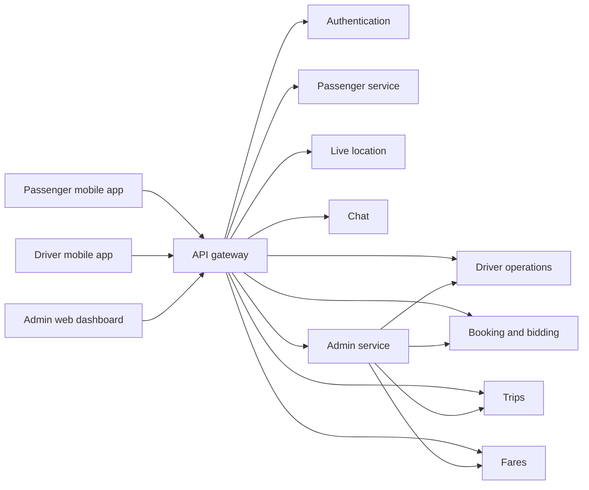

# BaoBao product plan and feature map

Last updated: 2026-07-29

This is the shared product-level source of truth for ongoing passenger, driver,
admin, and backend discussions. It records confirmed decisions, current code
surfaces, known gaps, and unresolved questions. It must not contain passwords,
tokens, personal test-account details, or payment credentials.

Status labels:

- **Present**: a screen, route, or backend operation exists in the current branch.
- **Partial**: some code exists, but the complete user workflow is missing or unverified.
- **Planned**: agreed scope exists, but it has not been proven in the current branch.
- **Open**: the team still needs to make a product or architecture decision.

“Present” does not mean production-ready. A feature becomes verified only after
its end-to-end acceptance test passes against a migrated disposable environment.

## System feature map



## Current access and runtime status

- **Admin**: one owner account now exists. The local dashboard is running at
  `http://localhost:5173`, but login and the full owner workflow still need a
  user-level test after the latest code is rebuilt.
- **Passenger**: 12 local accounts exist, but none is verified and no supported
  reusable test credential is known. Passenger registration and OTP screens
  exist. SMTP variables are configured, but real delivery is not yet proven.
- **Driver**: four local accounts exist, but none is verified and no supported
  reusable test credential is known. The backend has driver registration, but
  the driver app has no signup or verification screen.
- **Devices**: no Android emulator or physical Android phone was connected at
  the time of this update. Windows, Chrome, and Edge targets were visible.
- **Backend**: the API gateway responds locally. The currently running
  containers predate the latest pull and must be rebuilt before final testing.
- **Google authentication**: buttons exist in both apps, but they only show
  “coming soon.” There is no Google authentication flow.

### Can the mobile login screens be passed now?

- **Passenger**: not with an existing supported account. Start an Android
  device, register a dedicated test passenger through the app, receive the OTP,
  verify it, and then sign in.
- **Driver**: create a dedicated driver through `POST /auth/driver/register`,
  then sign in with that credential. The current driver client does not honor
  the backend’s `needsVerification` result and can enter the dashboard while
  unverified. That is useful evidence for UI testing, but it is a defect and
  must not be treated as a valid operational account.
- A driver still needs backend verification, operational approval, required
  documents, no active restriction, adequate service credit, and an active
  service zone before a real ride acceptance test is valid.

## Repository placement

Current:

```text
apps/passenger_app          Flutter passenger mobile app
apps/driver_app             Flutter driver mobile app
apps/admin_app              SvelteKit admin web frontend (placement disputed)
server/admin-service        Bun/Hono admin backend (placement is correct)
```

Proposed, pending teammate confirmation:

```text
apps/passenger_app
apps/driver_app
web/admin_app
server/admin-service
```

Only the Admin web frontend needs moving out of `apps`. The Admin backend
belongs under `server`. The exact web folder name and S3/CloudFront versus
SvelteKit server deployment must be decided before moving it.

## Confirmed product decisions

| Area | Current decision |
|---|---|
| Operating city | Pagadian City only for the pilot |
| Vehicle | Bao Bao is the pilot vehicle |
| Pilot coverage | Specific barangays are not selected yet |
| Zone defaults | All barangays begin inactive |
| Passenger payment | Cash is the expected initial ride-payment method |
| Driver commission funding | Prepaid driver service-credit balance |
| Initial commission | 10%, subject to final team approval before real rides |
| Commission reservation | Reserve the exact commission atomically when assignment succeeds |
| Credit balance | Cannot become negative |
| Top-up limits | ₱100 minimum; ₱1,000 maximum purchased-credit balance |
| Top-up verification | Driver submits reference; authorized employee verifies the external payment |
| Sensitive payment data | Never store wallet passwords, PINs, or secret payment credentials |
| Admin accounts | One privately provisioned owner; no public admin registration |
| Driver duplicate prevention | Driver’s-license identity is intended to be unique |
| Boundary data | Interim geometry is development-only until approved for public enforcement |
| Money storage | Integer centavos; rates in basis points |
| Time storage/display | UTC in APIs; Asia/Manila display |

## Passenger feature wireframe

### 1. Entry and account

- **Present**: onboarding.
- **Present**: email/password sign in.
- **Present**: passenger signup.
- **Present**: six-digit email OTP verification screen.
- **Present**: forgot-password, OTP, and password-reset screens.
- **Partial**: Google sign in and signup; visual button only.
- **Planned**: clear restricted-account messaging.

### 2. Home and places

- **Present**: passenger home with map and current location.
- **Present**: recent activity and suggestions surfaces.
- **Present**: saved places and add-category screens.
- **Present**: destination search.
- **Present**: nearby POI search up to 5 km with incremental loading.
- **Present**: Mapbox geocoding and map pin selection.
- **Present**: pickup and destination route preview.
- **Partial**: location-denied, Mapbox-unavailable, and empty-result behavior
  exist in parts but need device testing.

### 3. Fare and service selection

- **Present**: distance and duration route calculation.
- **Present**: server fare request with a local estimate fallback.
- **Present**: Solo Ride selection.
- **Present**: Share-Bao selection.
- **Present**: Bao Premium selection.
- **Present**: fare, ETA label, and route preview.
- **Open**: whether all three products belong in the pilot.
- **Open**: seat count and shared-ride pricing/route rules.
- **Open**: whether surge exists in the pilot.
- **Open**: the final base, distance, time, minimum, and rounding formula.

### 4. Booking and matching

- **Present**: create a booking/bidding session.
- **Present**: fetch nearby/eligible drivers.
- **Present**: receive driver offers.
- **Present**: passenger accepts an offer.
- **Present**: direct-booking path to a selected nearby driver.
- **Present**: cancellation of a search/session.
- **Planned**: exclude any driver who cannot reserve the exact commission.
- **Planned**: validate both pickup and destination against active zones.
- **Open**: driver-offer marketplace versus automatic nearest-eligible
  assignment as the primary pilot experience.
- **Open**: passenger and driver cancellation/no-show rules.

### 5. Active trip

- **Present**: finding-driver screen.
- **Present**: driver-matched screen.
- **Present**: live driver location lookup and tracking screen.
- **Present**: passenger-driver chat screen and backend chat room/WebSocket.
- **Present**: trip detail map.
- **Partial**: help and safety surfaces; some actions say “coming soon.”
- **Planned**: precise out-of-zone, restricted-account, and service-credit
  failure messages.

### 6. After the trip and account support

- **Present**: recent activity, full activity, ride history, and ride details.
- **Present**: driver rating screen.
- **Present**: passenger profile and profile-information screens.
- **Present**: inbox/notification surface and backend notification route.
- **Present**: settings and help center.
- **Partial**: several help-center actions and Safety Center are placeholders.
- **Open**: complaint submission entry point and required categories.

## Driver feature wireframe

### 1. Entry and driver identity

- **Present**: email/password sign in.
- **Present**: forgot-password request.
- **Partial**: Google sign in; visual button only.
- **Missing in client**: driver signup.
- **Missing in client**: driver OTP verification.
- **Present in backend**: driver registration and OTP generation.
- **Planned**: unique driver-license enforcement.
- **Planned**: operational approval separate from email verification.
- **Planned**: required document results: pending, verified, rejected, expired.
- **Planned**: temporary or indefinite restrictions.

### 2. Operating status and dashboard

- **Present**: dashboard.
- **Present**: online/offline control.
- **Present**: location telemetry while online.
- **Present**: dashboard statistics.
- **Present**: active-trip and incoming-request polling.
- **Present in backend**: eligibility checks for approval, documents,
  restrictions, zone, and available service credit.
- **Planned**: precise blocking reason in the driver UI.
- **Open**: the code currently permits up to five concurrent rides and applies
  special Bao Premium rules. The product team must decide whether this is valid
  for a Bao Bao pilot.

### 3. Offer and assignment

- **Present**: view active booking sessions.
- **Present**: submit a proposed-fare offer.
- **Present**: cancel an offer.
- **Present**: receive/continue an accepted trip.
- **Present in backend**: normal and manual assignment share eligibility and
  credit-reservation logic.
- **Planned**: driver is excluded or blocked when available credit is below
  the snapshotted commission.
- **Open**: whether drivers propose fares or only accept a platform-calculated
  fare during the pilot.

### 4. Trip lifecycle

- **Present**: ride alert.
- **Present**: en route to pickup.
- **Present**: arrived/waiting for passenger.
- **Present**: in transit.
- **Present**: complete trip.
- **Present**: fare summary.
- **Present**: rate passenger.
- **Present**: resume active trip after returning to the dashboard.
- **Present**: external map/navigation integration surface.
- **Partial**: some duration/distance values in the dashboard completion path
  are currently fixed fallback values and need real-trip validation.
- **Open**: wait time, no-show, cancellation, and unpaid-cash handling.

### 5. Earnings, credits, and account

- **Present**: trip history and trip details.
- **Present**: earnings screen and dashboard earnings statistics.
- **Present**: account screen.
- **Present**: service-credit balance.
- **Present**: immutable credit-ledger view.
- **Present**: top-up channel list.
- **Present**: top-up submission and history.
- **Present in backend**: minimum/cap, duplicate reference, adjustments,
  refunds, reservation, settlement, release, and dispute.
- **Planned**: low-balance warnings and fully tested blocking messages.

## Admin feature wireframe

### 1. Access

- **Present**: privately provisioned owner.
- **Present**: email/password login.
- **Present**: eight-hour admin JWT.
- **Present**: secure HttpOnly session cookie in the current SvelteKit design.
- **Present**: logout.
- **Present**: failed-login lock.
- **Open**: static S3/CloudFront hosting requires changing the current
  server-side authentication arrangement.

### 2. Overview

- **Present**: totals for trips, drivers, pending top-ups, cases, and zones.
- **Present**: operational queues and recent activity.
- **Present**: 10-second refresh on operational pages.

### 3. Driver compliance

- **Present**: list and filter drivers.
- **Present**: pending/approved/rejected operational approval.
- **Present**: owner-managed document requirement names.
- **Present**: document review status, expiry, note, reviewer, and time.
- **Present**: driver restrictions and lifting.
- **Deliberately excluded**: document image/file storage.

### 4. Dispatch

- **Present**: open requests and active trips.
- **Present**: Mapbox dispatch view.
- **Present**: manual assignment.
- **Present in backend**: manual assignment cannot bypass driver eligibility,
  fare snapshot, or commission reservation.
- **Open**: final assignment/matching policy.

### 5. Credits, top-ups, fares, and commission

- **Present**: top-up channels.
- **Present**: top-up review and rejection.
- **Present**: credit balance and ledger.
- **Present**: owner adjustments and verified refunds.
- **Present**: fare-rule management.
- **Present**: commission policy and future scheduling.
- **Planned**: operational runbook and real reconciliation exercise.

### 6. Zones

- **Present**: 54-name Pagadian barangay roster.
- **Present**: interim development polygons.
- **Present**: activate/deactivate zone.
- **Present in backend**: pickup and destination zone check.
- **Open**: pilot barangays.
- **Open**: approved boundary authority/source for public enforcement.

### 7. Complaints, restrictions, reports, and audit

- **Present**: cases targeting a trip, passenger, or driver.
- **Present**: open, under-review, resolved, and dismissed states.
- **Present**: optional linked restriction.
- **Present**: append-only audit view.
- **Present**: filtered CSV reports.
- **Present**: printable browser report routes.
- **Open**: complaint categories, escalation policy, support wording, and
  response targets.

## Backend and shared platform capabilities

| Capability | Current surface |
|---|---|
| Gateway | Routes public requests, strips client internal-auth headers |
| Authentication | Passenger, driver, and admin login; passenger/driver registration; OTP/reset |
| Passenger data | Profile, updates, ride history, restrictions, notifications |
| Driver data | Profile, online status, statistics, trips, reviews |
| Driver operations | Approval, documents, restrictions, credits, top-ups, eligibility |
| Booking/bidding | Sessions, offers, passenger acceptance, cancellation, manual assignment |
| Trip lifecycle | Create, assign, accept, status changes, history, reconciliation |
| Telemetry | Driver location update and lookup |
| Chat | Chat rooms, messages, resolution, WebSocket |
| Fare | Configurations, estimates, final fare, snapshots, commission |
| Admin | Overview, compliance, dispatch, money, zones, cases, reports, audit |
| Database | PostgreSQL with additive migrations and service-specific databases |
| Local orchestration | Docker Compose; only gateway/database and current admin web are host-exposed |

## Cross-team dependency matrix

| Product decision or contract | Passenger impact | Driver impact | Admin/backend impact | Status |
|---|---|---|---|---|
| Ride products and seat rules | Options and fare display | Capacity and concurrent rides | Pricing and dispatch rules | **Open** |
| Fare formula and rounding | Quote shown before booking | Earnings/fare summary | Fare rules and snapshots | **Open** |
| Matching model | Wait/offer selection UI | Offer or accept UI | Bidding and assignment logic | **Open** |
| 10% prepaid commission | Booking eligibility messaging | Balance and block reason | Reservation/ledger/settlement | **Planned** |
| Cancellation/no-show | Cancellation UI and charge | Release/compensation | Trip and credit transitions | **Open** |
| Cash not received | Support status | Dispute submission | Hold/review/reconciliation | **Open** |
| Active barangays | Out-of-zone message | Online/offer eligibility | Zone configuration | **Open** |
| Driver documents | Driver identity shown | Submission/status guidance | Requirement/review rules | **Open** |
| Complaint categories | Passenger support form | Driver support form | Case workflow | **Open** |
| Google authentication | Entry flow | Entry flow | OAuth/backend identity linking | **Deferred** |
| Admin hosting | None | None | Cookie/CORS/deployment architecture | **Open** |

## Known gaps and risks

1. Driver client ignores `needsVerification` after login.
2. Driver has no registration or verification screens.
3. Google authentication is presentation-only.
4. No Android device is currently connected for a real mobile run.
5. No supported verified passenger or driver test account exists.
6. The latest mobile and Docker changes have not completed a full clean
   end-to-end build and ride test.
7. Admin frontend folder and hosting strategy remain unresolved.
8. Current code contains product choices that were not explicitly approved:
   Bao Premium, up to five concurrent driver rides, and driver-proposed fares.
9. Some passenger support/safety actions are placeholders.
10. An Android generated build report is tracked in Git and should be reviewed
    for removal separately.

## Ordered open decisions

Ask and settle these one at a time:

1. Exact Admin web folder and deployment model.
2. Primary matching model: automatic nearest eligible driver, driver offers,
   or both.
3. Pilot ride products: Solo, Share-Bao, Bao Premium, or another set.
4. Bao Bao seat count and concurrent/shared-ride rules.
5. Fare formula, minimum fare, rounding, and whether surge exists.
6. Passenger and driver cancellation/no-show policy.
7. Unpaid-cash dispute and commission settlement policy.
8. Driver document list, expiry rules, and account lifecycle.
9. Pilot barangays and approved boundary source.
10. Complaint categories and support process.
11. Dedicated passenger and driver test-account ownership.
12. Production hosting, TLS, backups, monitoring, and secret ownership.

## Next smallest end-to-end test

1. Rebuild the merged local stack without deleting the PostgreSQL volume.
2. Start an Android emulator or connect an Android phone.
3. Register and OTP-verify one dedicated passenger.
4. Register one dedicated driver through the backend.
5. Fix or explicitly handle driver verification before calling the driver test
   operationally valid.
6. Approve the driver and required documents through Admin.
7. Activate one explicitly selected test barangay only after team confirmation.
8. Approve a test top-up.
9. Complete one traceable cash ride and reconcile the commission.

## Discussion log

### 2026-07-29

- Latest official commits were synced and merged into
  `codex/admin-service-mvp`.
- One owner account was provisioned.
- The team requested a shared passenger/driver/admin feature map because mobile
  and Admin contracts affect each other.
- The teammate does not want the Admin web frontend under `apps`.
- `web/admin_app` is proposed but not confirmed.
- Docker versus S3/CloudFront for the Admin frontend remains undecided.
- The assistant should ask focused product questions as new input arrives and
  update this file after decisions.
